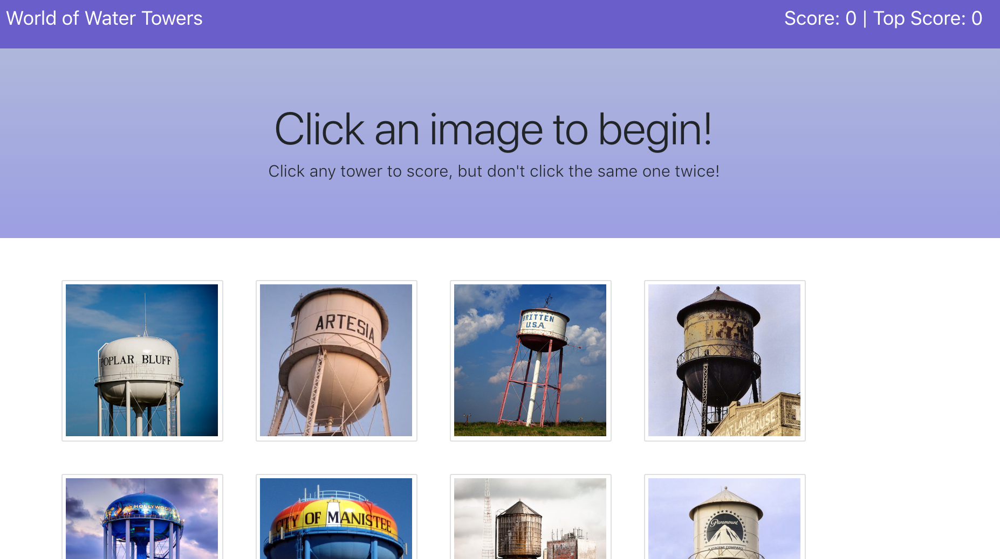

# remember-react
### World of Water Towers Memory Game
This is a front-end React application. The user clicks on an image to score a point, but must remember not to click the same image twice or they lose the game and the score resets to zero. The task is made more difficult for the player as the images shuffle randomly after each click.

### Live Link
Check out the World of Water Towers and test your memory on [here](https://water-tower-world.herokuapp.com/).

### Core Technologies
* JavaScript
* ReactJS
* JSX
* CSS 
* Bootstrap
